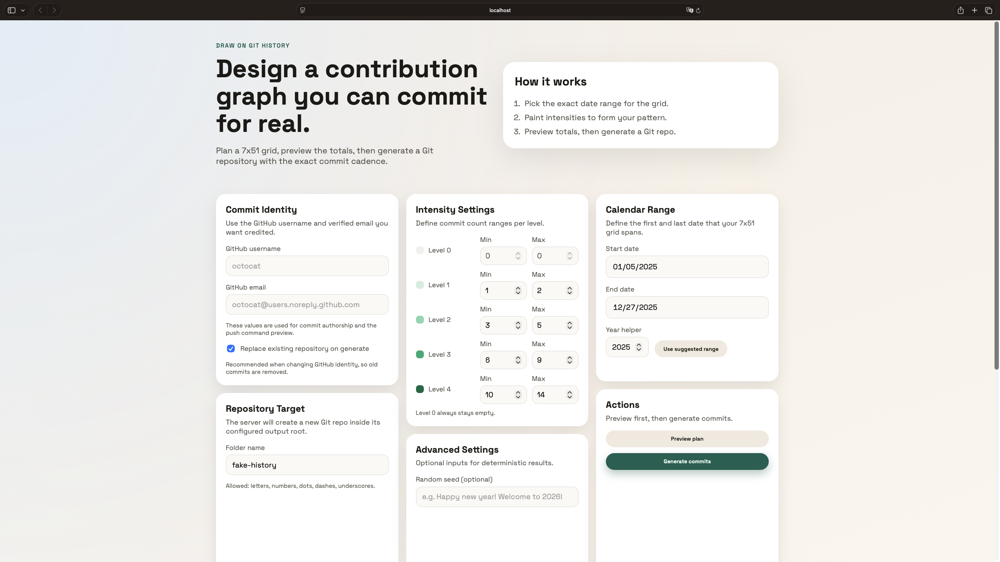
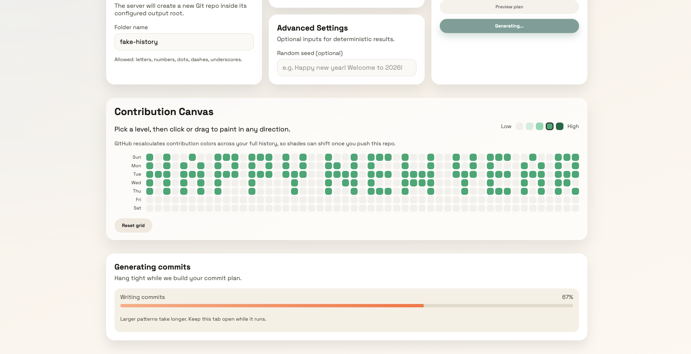

# Draw on Git History

A playful, precise way to sketch a GitHub-style contribution canvas and turn it into a real, pushable commit history.

<p align="center">
  
</p>

## Highlights
- **7x51 grid editor** that mirrors the drawable portion of a GitHub contribution year (first and last weeks excluded).
- **Deterministic commit planning** with optional random seeds for reproducibility.
- **Preview before write** to verify totals and warnings.
- **One-click generation** to create a fully initialized Git repository with dated commits.

## Quick Start

<p align="center">
  
</p>

### 1) Start the API server
```bash
cd server
npm install
npm run dev
```

The server listens on `http://localhost:4321` and writes generated repositories under `../` by default (so the default UI folder name `fake-history` resolves to `../fake-history`).

### 2) Start the web client
```bash
cd web
npm install
npm run dev
```

Open `http://localhost:5173` and start drawing.

## Notes
- Ensure `git` is installed and configured on your machine.
- Ensure Node.js and `npm` are installed to run the server and web client.
- The generated repository is local. To affect a GitHub contribution graph, push the repo to GitHub and ensure the commits use your account's email address.
- GitHub recalculates contribution colors based on your full history, so the final shades may shift after the new commits are added.
- Respect your organization's policies and GitHub's terms of service when generating synthetic histories.

## Push the Generated Repo to GitHub
After generation, create a GitHub repo with the same folder name under your
account (example: xuhuizhan5/fake_history), then push the local folder:

```bash
cd <FOLDER_NAME>
git remote add origin git@github.com:<GITHUB_USERNAME>/<FOLDER_NAME>.git
git push -u origin main
```

Example:
```bash
cd fake_history
git remote add origin git@github.com:xuhuizhan5/fake_history.git
git push -u origin main
```

<p align="center">
  
</p>

## Documentation

- Architecture overview: `docs/ARCHITECTURE.md`
- API reference: `docs/API.md`
- Algorithm details: `docs/ALGORITHM.md`
- UX rationale: `docs/UX.md`

## Star History

[](https://www.star-history.com/#xuhuizhan5/draw-on-git-history&type=date&legend=top-left)
